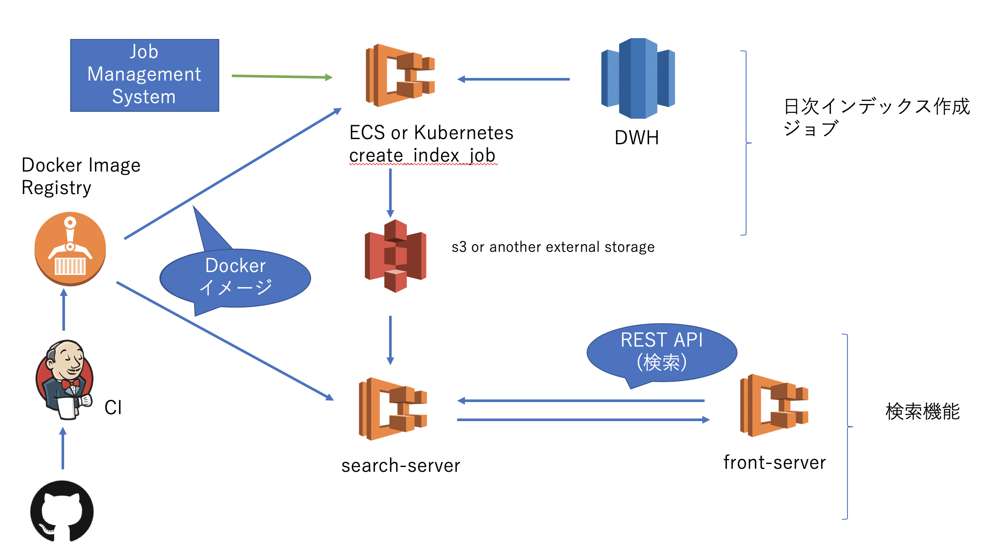

# Tiny Search Server Deployment Example

日本語のコンテナで動かせる小さな検索サーバのサンプルです。
基本的にElasticsearchやSolrを用いた検索サーバはデータベースと同じようにECSやKubernetesなどのコンテナオーケストレーション環境で管理することに向いていませんが、
小さなデータに対する検索システムであれば、インデックスを外部ストレージに保存することで
コンテナオーケストレーション環境で可用性とスケーラビリティを担保したデプロイができます。

## prepare environment

copy setenv.sh.sample to setenv.sh and fill in all parameters

## execute container job to create_index from postgresql or RedShift and save at S3 on local machine

```
$ make build_prod_docker
$ make run_job_docker
```

## execute elasticsearch server on local machine

```
$ make build_prod_docker
$ make run_app_docker
```

Access
```
curl -XGET localhost:9200 # elasticsearch
```

## run search application with docker-compose

```
$ docker-compose up
```

## Architecture


